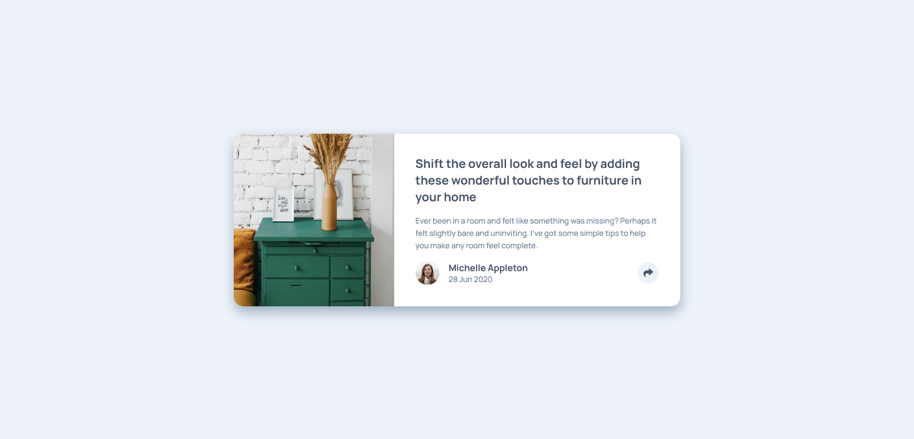

# Frontend Mentor - Article preview component solution

This is a solution to the [Article preview component challenge on Frontend Mentor](https://www.frontendmentor.io/challenges/article-preview-component-dYBN_pYFT). Frontend Mentor challenges help you improve your coding skills by building realistic projects. 

## Table of contents

- [Overview](#overview)
  - [The challenge](#the-challenge)
  - [Screenshot](#screenshot)
  - [Links](#links)
- [My process](#my-process)
  - [Built with](#built-with)
  - [What I Learned](#what-i-learned)
- [Author](#author)

## Overview

### The challenge

Users should be able to:

- View the optimal layout depending on their device's screen size
- See hover and focus states for interactive elements

### Screenshot



### Links

- Solution URL: [Solution URL](https://github.com/apr61/apr61.github.io/tree/main/article-preview-component-master/)
- Live Site URL: [Live site URL](https://apr61.github.io/article-preview-component-master/)

## My process

### Built with

- Semantic HTML5 markup
- CSS custom properties
- Flexbox
- Mobile-first workflow

### What I Learned

```css
  .share-modal{
        bottom: 36%;
        width: 250px;
        left: 76%;
        justify-content: space-around;
        border-radius: 10px;
        padding: .7rem 1.75rem;
    }
    .share-modal::after{
        content: '';
        position: absolute;
        bottom: -15px;
        border-bottom: none;
        border-top: 15px solid var(--very-dark-gray-blue);
        border-right: 15px solid transparent;
        border-left: 15px solid transparent;
    }
    .card-image img{
        border-radius: 1rem 0 0 1rem;
        object-fit: fill;
        width: 100%;
        height: 100%;
    }

```

## Author

- Frontend Mentor - [@apr61](https://www.frontendmentor.io/profile/apr61)
- Twitter - [@apradeepreddy9](https://www.twitter.com/apradeepreddy9)
