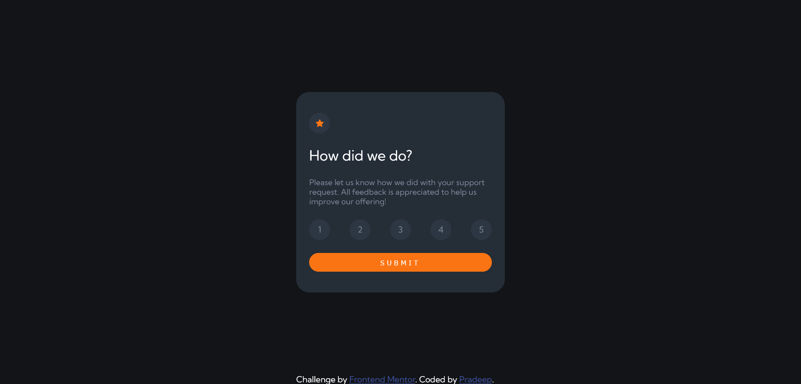

# Frontend Mentor - Interactive rating component solution

This is a solution to the [Interactive rating component challenge on Frontend Mentor](https://www.frontendmentor.io/challenges/interactive-rating-component-koxpeBUmI). Frontend Mentor challenges help you improve your coding skills by building realistic projects.

## Table of contents

- [Overview](#overview)
  - [The challenge](#the-challenge)
  - [Screenshot](#screenshot)
  - [Links](#links)
- [My process](#my-process)
  - [Built with](#built-with)
  - [What I Learned](#what-i-learned)
- [Author](#author)

## Overview

### The challenge

Users should be able to:

- View the optimal layout depending on their device's screen size
- See hover and focus states for interactive elements

### Screenshot



### Links

- Solution URL: [Solution URL](https://github.com/apr61/apr61.github.io/tree/main/nft-preview-card-component-main/)
- Live Site URL: [Live site URL](https://apr61.github.io/nft-preview-card-component-main/)

## My process

### Built with

- Semantic HTML5 markup
- CSS custom properties
- Flexbox
- Mobile-first workflow

### What I Learned

```JS
    let ratingValue;
    let selecteddiv;
    rating.addEventListener('click', (e) => {
        let target = e.target;
        ratingValue = target.textContent;
        highlight(target);
    })

    const highlight = (target) => {
        if(selecteddiv){
            selecteddiv.classList.remove('highlight');
        }
        selecteddiv = target;
        selecteddiv.classList.add('highlight');
    }

```

## Author

- Frontend Mentor - [@apr61](https://www.frontendmentor.io/profile/apr61)
- Twitter - [@apradeepreddy9](https://www.twitter.com/apradeepreddy9)
