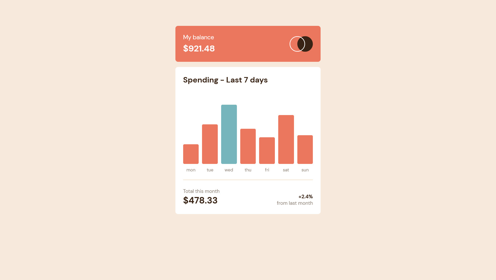

# Frontend Mentor - Expenses chart component solution

This is a solution to the [Expenses chart component challenge on Frontend Mentor](https://www.frontendmentor.io/challenges/expenses-chart-component-e7yJBUdjwt). Frontend Mentor challenges help you improve your coding skills by building realistic projects. 

## Table of contents

- [Overview](#overview)
  - [The challenge](#the-challenge)
  - [Screenshot](#screenshot)
  - [Links](#links)
- [My process](#my-process)
  - [Built with](#built-with)
  - [What I Learned](#what-i-learned)
- [Author](#author)

## Overview

### The challenge

Users should be able to:

- View the optimal layout depending on their device's screen size
- See hover and focus states for interactive elements

### Screenshot



### Links

- Solution URL: [Solution URL](https://github.com/apr61/apr61.github.io/tree/main/junior/expenses-chart-component-main)
- Live Site URL: [Live site URL](https://apr61.github.io/junior/expenses-chart-component-main)

## My process

### Built with

- Semantic HTML5 markup
- CSS custom properties
- Flexbox
- Mobile-first workflow

### What I Learned

```css
  .mon::after,
  .tue::after,
  .wed::after,
  .thu::after,
  .fri::after,
  .sat::after,
  .sun::after{
      content: attr(data-day);
      position: absolute;
      font-size: .85rem;
      color: var(--clr-neutral-med-brown);
      left: 50%;
      bottom: -2.25rem;
      transform: translateX(-50%) translateY(-50%);
  }

```
```JS
     day.setAttribute('data-day', `${dayData.day}`);
```

## Author

- Frontend Mentor - [@apr61](https://www.frontendmentor.io/profile/apr61)
- Twitter - [@apradeepreddy9](https://www.twitter.com/apradeepreddy9)
