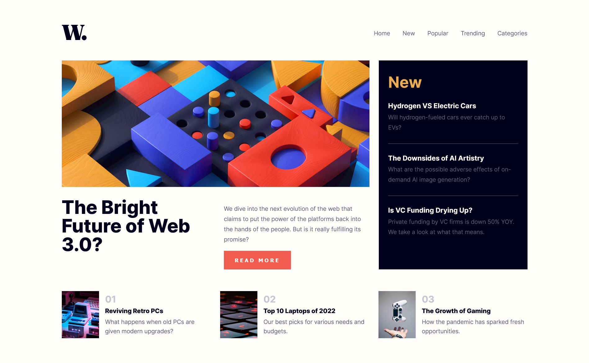

# Frontend Mentor - News homepage solution

This is a solution to the [News homepage challenge on Frontend Mentor](https://www.frontendmentor.io/challenges/news-homepage-H6SWTa1MFl). Frontend Mentor challenges help you improve your coding skills by building realistic projects. 

## Table of contents

- [Overview](#overview)
  - [The challenge](#the-challenge)
  - [Screenshot](#screenshot)
  - [Links](#links)
- [My process](#my-process)
  - [Built with](#built-with)
  - [What I Learned](#what-i-learned)
- [Author](#author)

## Overview

### The challenge

Users should be able to:

- View the optimal layout depending on their device's screen size
- See hover and focus states for interactive elements

### Screenshot



### Links

- Solution URL: [Solution URL](https://github.com/apr61/apr61.github.io/tree/main/junior/news-homepage-main)
- Live Site URL: [Live site URL](https://apr61.github.io/junior/news-homepage-main)

## My process

### Built with

- Semantic HTML5 markup
- CSS custom properties
- Flexbox
- Mobile-first workflow

### What I Learned

```css
  header nav.open-menu {
    position: fixed;
    top: 0;
    bottom: 0;
    right: 0;
    width: 75vw;
    background-color: var(--clr-neutral-white);
    display: flex;
    justify-content: center;
    flex-direction: column;
    padding-left: 1.25rem;
    font-size: 1.25rem;
    box-shadow: 15px 15px 10px 30vw hsl(0, 0%, 0%, .4);
    transition: all 3ms ease-in-out;
  }

```

## Author

- Frontend Mentor - [@apr61](https://www.frontendmentor.io/profile/apr61)
- Twitter - [@apradeepreddy9](https://www.twitter.com/apradeepreddy9)
