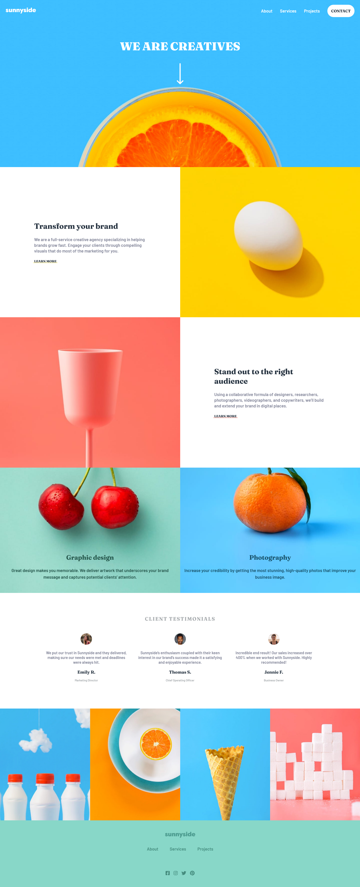

# Frontend Mentor - Sunnyside agency landing page solution

This is a solution to the [Sunnyside agency landing page challenge on Frontend Mentor](https://www.frontendmentor.io/challenges/sunnyside-agency-landing-page-7yVs3B6ef). Frontend Mentor challenges help you improve your coding skills by building realistic projects.

## Table of contents

- [Overview](#overview)
  - [The challenge](#the-challenge)
  - [Screenshot](#screenshot)
  - [Links](#links)
- [My process](#my-process)
  - [Built with](#built-with)
  - [What I learned](#what-i-learned)
- [Author](#author)
- [Acknowledgments](#acknowledgments)

## Overview

### The challenge

Users should be able to:

- View the optimal layout for the site depending on their device's screen size
- See hover states for all interactive elements on the page

### Screenshot



### Links

- Solution URL: [Solution url](https://github.com/apr61/apr61.github.io/tree/main/junior/sunnyside-agency-landing-page-main)
- Live Site URL: [live site URL](https://apr61.github.io/junior/sunnyside-agency-landing-page-main)

## My process

### Built with

- Semantic HTML5 markup
- CSS custom properties
- Flexbox
- CSS Grid
- Mobile-first workflow

### What I learned

```css
.graphic-design {
    position: relative;
    background-image: url('./images/mobile/image-graphic-design.jpg');
    background-repeat: no-repeat;
    background-size: cover;
    background-position: center;
    width: 100%;
    height: 33rem;
    max-height: 20%;
    resize: both;
}
```

## Author

- Frontend Mentor - [@apr61](https://www.frontendmentor.io/profile/apr61)
- Twitter - [@apradeepreddy9](https://www.twitter.com/apradeepreddy9)

## Acknowledgments

I found [catherineisonline](https://github.com/catherineisonline/sunnyside-agency-landing-page-frontendmentor) solution helpful.