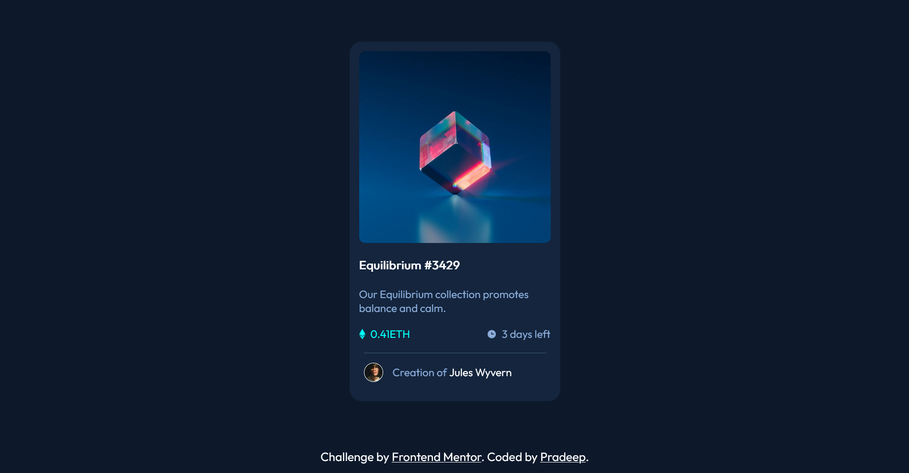

# Frontend Mentor - NFT preview card component solution

This is a solution to the [NFT preview card component challenge on Frontend Mentor](https://www.frontendmentor.io/challenges/nft-preview-card-component-SbdUL_w0U). Frontend Mentor challenges help you improve your coding skills by building realistic projects. 

## Table of contents

- [Overview](#overview)
  - [The challenge](#the-challenge)
  - [Screenshot](#screenshot)
  - [Links](#links)
- [My process](#my-process)
  - [Built with](#built-with)
  - [What I Learned](#what-i-learned)
- [Author](#author)


## Overview

### The challenge

Users should be able to:

- View the optimal layout depending on their device's screen size
- See hover and focus states for interactive elements

### Screenshot



### Links

- Solution URL: [Solution URL](https://github.com/apr61/apr61.github.io/tree/main/nft-preview-card-component-main/)
- Live Site URL: [Live site URL](https://apr61.github.io/nft-preview-card-component-main/)

## My process

### Built with

- Semantic HTML5 markup
- CSS custom properties
- Flexbox
- Mobile-first workflow

### What I Learned

```html
<div class="image">
	
	<div class="hover">
		
	</div>
</div>
```
```css
.image {
    border-radius: 10px;
    overflow: hidden;
    position: relative;
}
  
.image img {
    max-width: 100%;
    display: block;
}
/* hovering position */
.hover {
    position: absolute;
    top: 0;
    left: 0;
    width: 100%;
    height: 100%;
    background-color: hsla(178, 100%, 50%, 0.5);
    opacity: 0;
    transition: opacity 0.2s ease-in-out;
}
  
.hover img {
    position: absolute;
    width: 50px;
    top: 50%;
    left: 50%;
    transform: translate(-50%, -50%);
}
/* Image hover effect */
.image:hover .hover {
    opacity: 1;
    display: block;
    cursor: pointer;
}
```

## Author

- Frontend Mentor - [@apr61](https://www.frontendmentor.io/profile/apr61)
- Twitter - [@apradeepreddy9](https://www.twitter.com/apradeepreddy9)
