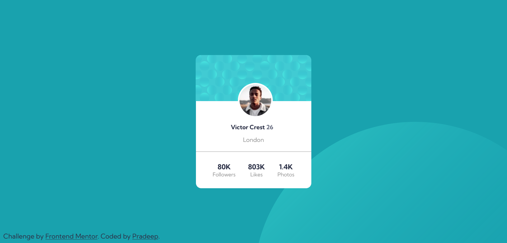

# Frontend Mentor - Profile card component solution

This is a solution to the [Profile card component challenge on Frontend Mentor](https://www.frontendmentor.io/challenges/profile-card-component-cfArpWshJ). Frontend Mentor challenges help you improve your coding skills by building realistic projects. 

## Table of contents

- [Overview](#overview)
  - [The challenge](#the-challenge)
  - [Screenshot](#screenshot)
  - [Links](#links)
- [My process](#my-process)
  - [Built with](#built-with)
- [Author](#author)


## Overview

### The challenge

- Build out the project to the designs provided

### Screenshot




### Links

- Solution URL: [Solution URL](https://github.com/apr61/apr61.github.io/tree/main/profile-card-component-main/)
- Live Site URL: [Live site URL](https://apr61.github.io/profile-card-component-main/)

## My process

### Built with

- Semantic HTML5 markup
- CSS custom properties
- Flexbox
- CSS Grid
- Mobile-first workflow


### What I learned


```html
<div class="image">
	
	
</div>
```
```css
.back{
	background-image: url(./images/bg-pattern-top.svg),url(./images/bg-pattern-bottom.svg);
    background-repeat: no-repeat , no-repeat;
    background-position: right 50vw bottom 50vh, left 50vw top 50vh;
}
.image{
    position: relative;
    display: flex;
}

.image .pic-bg{
    border-radius: 1em 1em 0 0;
}

.profile-pic{
    border-radius: 50%;
    margin: auto;
    position: absolute;
    bottom: -50px;
    left: 8rem;
    border: 5px solid white;
}
```


## Author

- Frontend Mentor - [@apr61](https://www.frontendmentor.io/profile/apr61)
- Twitter - [@apradeepreddy9](https://www.twitter.com/apradeepreddy9)
