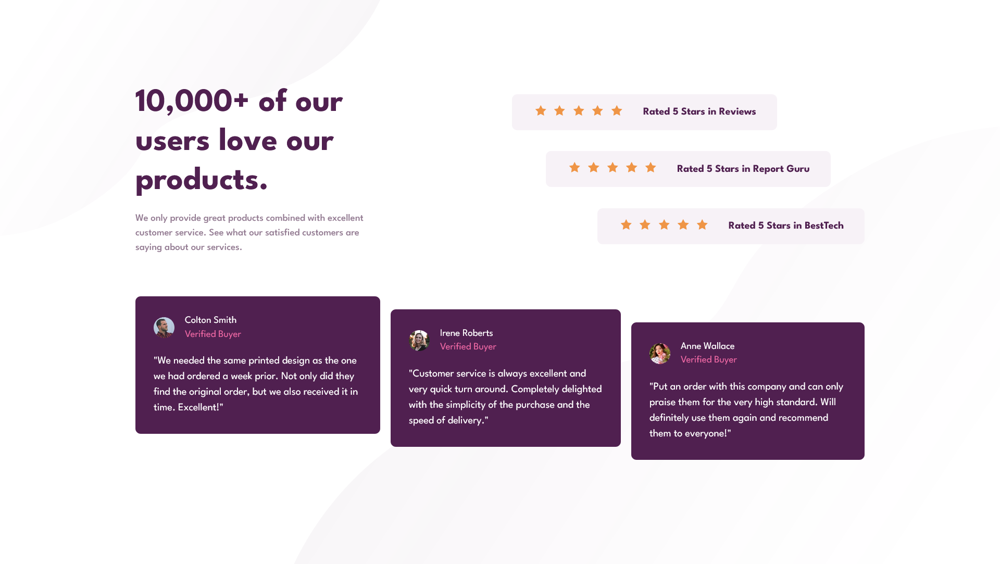

# Frontend Mentor - Social proof section solution

This is a solution to the [Social proof section challenge on Frontend Mentor](https://www.frontendmentor.io/challenges/social-proof-section-6e0qTv_bA). Frontend Mentor challenges help you improve your coding skills by building realistic projects. 

## Table of contents

- [Overview](#overview)
  - [The challenge](#the-challenge)
  - [Screenshot](#screenshot)
  - [Links](#links)
- [My process](#my-process)
  - [Built with](#built-with)
  - [What I Learned](#what-i-learned)
- [Author](#author)

## Overview

### The challenge

Users should be able to:

- View the optimal layout depending on their device's screen size
- See hover and focus states for interactive elements

### Screenshot



### Links

- Solution URL: [Solution URL](https://github.com/apr61/apr61.github.io/tree/main/social-proof-section-master/)
- Live Site URL: [Live site URL](https://apr61.github.io/social-proof-section-master/)

## My process

### Built with

- Semantic HTML5 markup
- CSS custom properties
- Flexbox
- Mobile-first workflow

### What I Learned

```css
  .container {
        grid-template-columns: 1fr 1fr;
        margin: 8rem auto;
    }

    .content {
        grid-column: 1 / 2;
    }

    .rating {
        grid-column: 2 / 3;
    }

    .cards {
        grid-column: 1 / -1;
    }

    .rating-card:first-child {
        margin-left: 0;
    }

    .rating-card:last-child {
        margin-right: 0;
    }

    .user-review:nth-child(2) {
        transform: translateY(1.25rem);
    }

    .user-review:last-child {
        transform: translateY(2.5rem);
    }

```

## Author

- Frontend Mentor - [@apr61](https://www.frontendmentor.io/profile/apr61)
- Twitter - [@apradeepreddy9](https://www.twitter.com/apradeepreddy9)